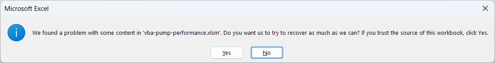

# Building the solution

We'll first create a Excel file with a custom ribbon and then add the VBA code to build the Add-in.

## Adding a custom component to the Ribbon

1. Create a blank workbook in Excel, disable the autosave mode, and save it with the name ```vba-pump-performance.xlsm```.

2. Add a **.zip** extension to the document file name and then open the file.

3. Add the customization files to the containner by dragging the folder ```customUI``` to the **.zip** file.

4. Extract the **_rels** folder to your desktop. Open it and edit the **.rels** file. Add the following line between the last Relationship tag and the Relationships tag. This creates a relationship between the document file and the customization file:

    ```
    <Relationship Id="pump-performance" Type="http://schemas.microsoft.com/office/2007/relationships/ui/extensibility" Target="customUI/customUI.xml"/>
    ```

5. Close and save the file. Add the **.rels** file back to the container file by dragging it from the desktop, overwriting the existing file.

6. Rename the document file to its original name by removing the .zip extension. 

7. Open the document, probably the Excel will return the folowing message:

    .

    Click "Yes" and notice that the ribbon now displays the ```Pump Performance``` tab.

8. Save the document, the Excel will display the message:

    .

    Click OK and the custom component ready!

## Loading the VBA modules

1. Open the recently created ```vba-pump-performance.xlsm```.

2. Through the developer tab, access Visual Basic and import the script ```00 - ImportModules.bas```.

3. Run the sub and when asked by the dialog system, select the folder ```vba-pump-performance\src```.